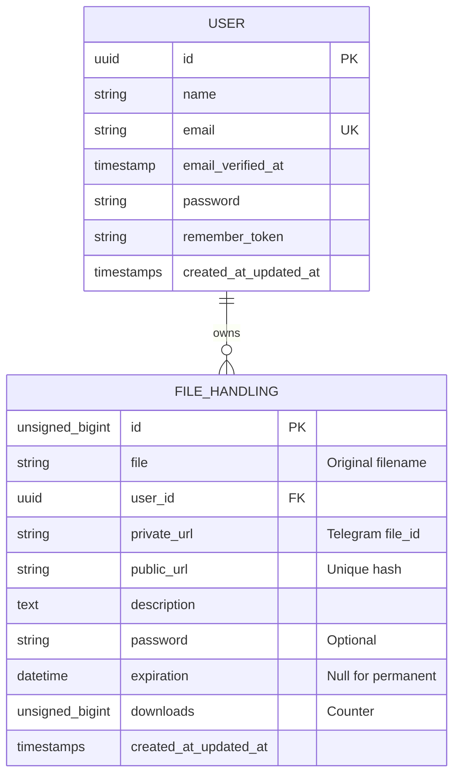

<div align="center">
  
</div>

[](https://laravel.com)
[](https://laravel.com/docs/blade)
[](https://tailwindcss.com)
[](LICENSE)
[](https://wakatime.com/badge/github/RyannKim327/Anesidora)

Anesidora is a secure, premium file-sharing and file hosting web application built with **Laravel**. Inspired by **Anesidora** (meaning "giver of gifts" in Greek mythology), this platform allows users to share files as "gifts" with secure links, passwords, and custom metadata.

---

## 👨‍💻 Developer Information
* **Lead Developer:** MPOP Reverse II [Ryann Kim Sesgundo]

---

## 💡 Project Context & Idea
The primary mission of **Anesidora** is to make sharing files a premium, secure, and interactive experience:
1. **Gift-Giving Paradigm:** Sharing a file is treated as sending a gift. Each shared asset can include a title, detailed description, and custom security settings.
2. **User Profiles:** Personalized dashboard for users to manage their shared "gifts," view detailed statistics, and track downloads.
3. **Robust Security:** Support for password-protecting downloads, setting strict link expiration limits, managing visibility via public/private URLs, and **request throttling** to prevent automated abuse.
4. **Optimized Delivery:** Built with Laravel's Blade engine for high-performance server-side rendering and seamless user interaction.

---

## 🎨 Design Philosophy
Anesidora features a **dark color-based theme** that emphasizes high-contrast modern elements:
* **Background Palette:** Deep slate-blue backdrop (`#1a1a2e`) representing nighttime and deep space.
* **Glow & Gradients:** Vibrant neon violet-to-pink gradients (`#8b5cf6` to `#c084fc`) symbolizing glowing mystical gifts.
* **Premium Glassmorphism:** Backdrop filters, semi-transparent borders, and glowing box shadows to build a high-fidelity visual experience.

---

## 🛠️ Tech Stack & Versions
* **Backend:** PHP `^8.3`, Laravel `^13.8`
* **Frontend:** Laravel Blade Engine
* **Styling:** Tailwind CSS `^4.3.0`
* **Build Tool:** Vite `^8.0.0`
* **Database:** SQLite (Metadata storage)
* **Storage:** Telegram Bot API (Encrypted cloud storage)

---

## 📊 Database Schema
Anesidora uses a clean, relational schema to manage users and their shared "gifts":



---

## 🚀 Getting Started

### Prerequisites
- PHP ^8.3
- Node.js & NPM
- Composer

### Installation
1. Clone the repository
2. Install dependencies:
   ```bash
   composer install
   npm install
   ```
3. Set up environment:
   ```bash
   cp .env.example .env
   php artisan key:generate
   ```
4. Run migrations:
   ```bash
   php artisan migrate
   ```

### Running the Application
```bash
npm run dev
```

---

## 📂 File Structure

* 📂 **[resources/views/](file:///home/mpop/Programming/php/Anesidora/resources/views)** — Laravel Blade Templates
  * 📄 **[app.blade.php](file:///home/mpop/Programming/php/Anesidora/resources/views/app.blade.php)** — Base layout file.
  * 📄 **[upload.blade.php](file:///home/mpop/Programming/php/Anesidora/resources/views/upload.blade.php)** — File upload interface.
  * 📄 **[profile.blade.php](file:///home/mpop/Programming/php/Anesidora/resources/views/profile.blade.php)** — User profile and statistics.
  * 📄 **[index.blade.php](file:///home/mpop/Programming/php/Anesidora/resources/views/index.blade.php)** — Dashboard and file listing.
  * 📂 **[components/](file:///home/mpop/Programming/php/Anesidora/resources/views/components)** — Reusable Blade components.
* 📂 **[routes/](file:///home/mpop/Programming/php/Anesidora/routes)**
  * 📄 **[web.php](file:///home/mpop/Programming/php/Anesidora/routes/web.php)** — Web routes.
  * 📂 **[api/](file:///home/mpop/Programming/php/Anesidora/routes/api)** — API endpoints for file operations.
* 📂 **[app/](file:///home/mpop/Programming/php/Anesidora/app)** — Core Laravel backend logic.

---

## 🎓 License
This project is open-sourced under the **MIT License**. 

---

## 🤝 Credits & Acknowledgements
* **Google Gemini:** Assisted with drafting configuration details, generating clean architectural plans, and code reviews.
* **AntiGravity:** Designed the file/folder structural documentation format and naming conventions.
